# POS – Retail Clothing Store

**POS-Retail-Clothing-Store** is a full-stack **Point of Sale (POS) system for brick-and-mortar clothing stores**, engineered following the **Unified Process (UP)** methodology (*Applying UML and Patterns*, Craig Larman).

It streamlines retail operations including point-of-sale transactions, multi-variant inventory management (styles, sizes, colors, SKUs), role-based security, employee access control, and executive sales analytics.

---

## Unified Process Documentation Architecture

The system documentation is organized across all four official Unified Process (UP) lifecycle phases:

```mermaid
flowchart LR
    subgraph P1["Phase 1: Inception"]
        I1["Inception Report"]
        I2["Problem Statement"]
        I3["Risk & Feasibility"]
        I4["High-Level Requirements"]
    end

    subgraph P2["Phase 2: Elaboration"]
        E1["Elaboration Report"]
        E2["Detailed Use Cases (100%)"]
        E3["System Sequence Diagrams"]
        E4["Domain Model & DCD"]
        E5["Architecture Baseline"]
    end

    subgraph P3["Phase 3: Construction"]
        C1["Construction Report"]
        C2["Implementation & Testing"]
    end

    subgraph P4["Phase 4: Transition"]
        T1["Transition Report"]
        T2["Deployment & User Manual"]
    end

    P1 --> P2 --> P3 --> P4
```



---

## Master Table of Contents

### Phase 1: Inception Phase
*Objective: Establish project scope, business viability, high-level requirements, and risk/feasibility baseline (LCO Milestone).*
- [Inception Phase Report](docs/inception_report.md)
- [Problem Statement & Business Case](docs/problem_statement.md)
- [Risk List & Feasibility Study](docs/risk_and_feasibility.md)
- [High-Level Requirements (FURPS+ Model)](docs/high_level_requirements.md)

### Phase 2: Elaboration Phase
*Objective: Establish 3-tier architecture baseline, detail all use cases, and define domain/design models (LCA Milestone).*
- [Elaboration Phase Report](docs/elaboration_report.md)
- [Detailed Use Cases (100% Fully Dressed)](docs/detailed_use_cases.md)
- [System Sequence Diagrams (SSDs for UC1–UC8)](docs/system_sequence_diagrams.md)
- [Domain Model & Software Design Class Diagram (DCD)](docs/domain_model.md)
- [3-Tier Architecture & REST API Specification](docs/architecture.md)
- [Database Design (ERD, Table Definitions & Normalization)](docs/database_design.md)

### Phase 3: Construction Phase
*Objective: Build production application, SQLite persistence, React UI, and verify 100% passing test suite (IOC Milestone).*
- [Construction Phase Report](docs/construction_report.md)
- [Implementation & Testing Specification (28/28 Unit Tests Passing)](docs/implementation_and_testing.md)

### Phase 4: Transition Phase
*Objective: Deploy system, onboard staff with role manuals, seed database, and finalize release handover (PR Milestone).*
- [Transition Phase Report & Release Notes (v1.0.0)](docs/transition_report.md)
- [Deployment Guide & Role Operations Manual](docs/deployment_and_user_manual.md)

---

### Backend API documentations
*the fillowing provides the whole backend documentation, endpoints, expected data in post requests and returned data in GET requests, the structure of the db.*
- [Backend API docs](docs/backend_docs.md)

---

## Quick Start Guide

### Prerequisites
- Node.js (v18+) & npm

### Backend Setup
```bash
cd backend
npm install
npm run seed   # Creates database schema & seeds initial demo store data
npm test       # Runs automated Jest unit test suite (28/28 tests pass)
npm run dev    # Starts REST API server on http://localhost:4000
```

### Frontend Setup (Separate Terminal)
```bash
cd frontend
npm install
npm run dev    # Starts React Vite frontend application (e.g. http://localhost:5173)
```

---

## Built With
- **Frontend:** React, Vite, Tailwind CSS / Custom CSS, Lucide Icons
- **Backend:** Node.js, Express, `node:sqlite` (SQLite3)
- **Testing:** Jest
- **Methodology:** Unified Process (UP), GRASP Patterns, 3-Tier Layered Architecture