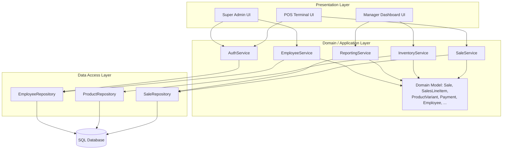

# Architectural Proof-of-Concept – POS Retail Clothing Store

**UP Phase:** Elaboration – Iteration 1

Per the [Inception Report](inception_report.md), the system commits to a **3-tier layered architecture**. This document elaborates that commitment into a concrete proof-of-concept, addressing the highest architectural risk identified in the [Risk List](risk_and_feasibility.md): poor separation of concerns leading to slow, inconsistent, hard-to-test code.

## Layered Architecture

## Layer Responsibilities

| Layer | Responsibility | Depends on |
|---|---|---|
| **Presentation** | Renders screens per role (Cashier, Manager, Super Admin); captures input; contains no business rules. | Domain/Application layer only |
| **Domain / Application** | Implements use-case logic (`processSale`, `restockItem`, `authenticate`, `generateReport`) and holds the domain model (Sale, ProductVariant, Employee, etc.). | Data Access layer only |
| **Data Access** | Translates domain objects to/from persistent storage (repositories/DAOs); isolates SQL from business logic. | Database only |

## Why This Layering Addresses the Top Risk

- **Poor database design / performance risk** (from the risk list) is contained to the Data Access layer — schema or query changes do not ripple into UI or business logic.
- **Security vulnerabilities risk** is addressed by routing all role-sensitive operations (Manager/Super Admin screens) through `AuthService` before reaching the Domain layer. `AuthService` grants the Super Admin role every permission granted to Cashier and Store Manager, and reserves employee onboarding/role assignment (`EmployeeService`) exclusively for Super Admin.
- **Testability**: the Domain/Application layer can be unit-tested against the Data Access layer's repository interfaces without a UI or live database, supporting the Construction phase's test-case requirements.

## Mapping to Use Cases

| Use Case | Primary Service | Primary Repository |
|---|---|---|
| Login (UC1) | AuthService | EmployeeRepository |
| Process Sale (UC2) | SaleService | SaleRepository, ProductRepository |
| Manage Inventory – Restock (UC3) | InventoryService | ProductRepository |

This proof-of-concept will be validated by implementing UC2 (Process Sale) end-to-end through all three layers as the first Construction-phase spike, since it is the highest-value, highest-traffic use case.
