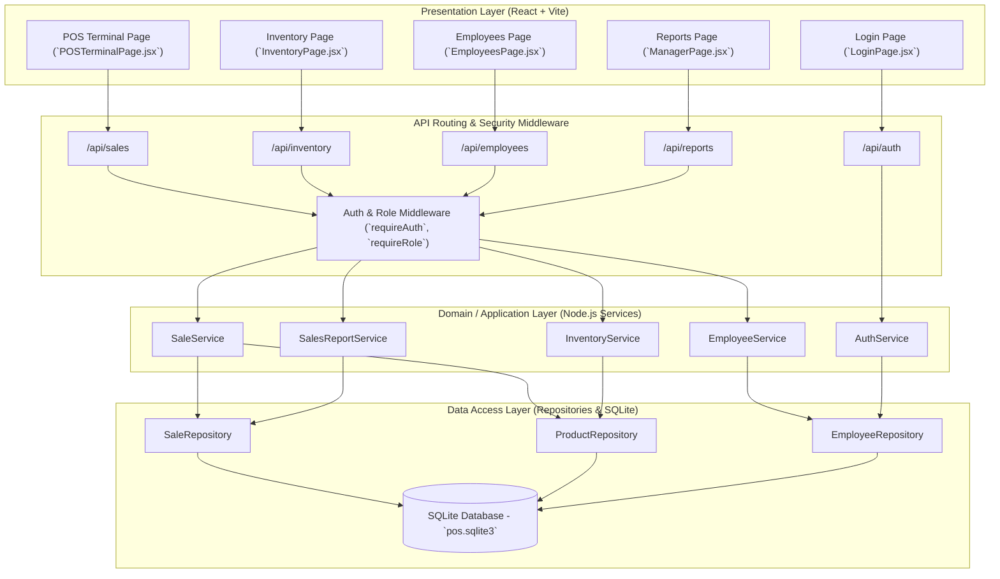

# Architectural Proof-of-Concept & Baseline – POS Retail Clothing Store

**UP Phase:** Elaboration Phase  
**Milestone:** Lifecycle Architecture Baseline (LCA)

---

## 1. Architectural Overview & 3-Tier Layering

The system follows a strict **3-Tier Layered Architecture** separating **Presentation**, **Domain / Application**, and **Data Access** concerns. This design directly mitigates high-priority technical risks: poor database performance, security breaches, and untestable business logic.

---

## 2. Layer Responsibilities & Design Rules

| Layer | Component Scope | Design Rules & Responsibilities |
|---|---|---|
| **Presentation** | React components (`src/pages`, `src/context`) | Handles UI rendering, user interaction, client state (`AuthContext`, `ThemeContext`), and calls HTTP client API endpoints. Contains zero business logic or SQL statements. |
| **API / Middleware** | Express routes & middleware (`backend/src/routes`, `middleware`) | Intercepts HTTP requests, validates request payloads, executes `requireRole(...)` authentication/authorization middleware, and forwards calls to application services. |
| **Domain / Application** | Services (`backend/src/services`) | Implements core use-case logic (`processSale`, `restockItem`, `authenticate`, `onboardEmployee`, `generateReport`). Orchestrates business transaction boundaries and rule enforcement. |
| **Data Access** | Repositories (`backend/src/repositories`) | Encapsulates database persistence operations (`node:sqlite`). Translates raw SQL rows into domain structures. Isolates SQL queries from services. |
| **Persistence Layer** | Relational Database (`backend/data/pos.sqlite3`) | Stores normalized relational tables: `employees`, `product_specifications`, `product_variants`, `sales`, `sales_line_items`, `payments`, `customers`, and `stock_adjustments`. |

---

## 3. Comprehensive REST API Endpoints Specification

| Method | Endpoint Path | Target Service | Allowed Roles | Description |
|---|---|---|---|---|
| `POST` | `/api/auth/login` | `AuthService` | Public | Authenticate employee credentials; returns session token & role |
| `POST` | `/api/sales` | `SaleService` | `cashier`, `manager`, `superadmin` | Process and record a completed sale atomically |
| `GET` | `/api/inventory` | `InventoryService` | All Roles | Fetch list of product variants, prices, and quantities on hand |
| `POST` | `/api/inventory/restock` | `InventoryService` | `manager`, `superadmin` | Adjust stock quantity received and record audit log |
| `POST` | `/api/inventory/products` | `InventoryService` | `manager`, `superadmin` | Add new product variant (style, SKU, size, color, price) |
| `GET` | `/api/employees` | `EmployeeService` | `superadmin` | Retrieve complete list of store employees |
| `POST` | `/api/employees` | `EmployeeService` | `superadmin` | Onboard new employee with role credentials |
| `PATCH` | `/api/employees/:id/role` | `EmployeeService` | `superadmin` | Change role assignment for existing employee |
| `DELETE` | `/api/employees/:id` | `EmployeeService` | `superadmin` | Soft delete employee account (`is_active = 0`) |
| `GET` | `/api/reports/sales` | `SalesReportService` | `manager`, `superadmin` | Generate aggregated sales analytics and summary totals |

---

## 4. Architectural Proof-of-Concept Spike Verification

The architectural proof-of-concept verified that:
1. **Vertical Integration:** A request initiated from `POSTerminalPage` accurately hits `/api/sales`, passes `requireAuth` middleware, triggers `saleService.processSale()`, executes SQL transactions via `saleRepository`, and updates `productRepository` stock levels atomically.
2. **Security Isolation:** Route middleware rejects requests lacking valid authorization headers or targeting endpoints above the user's role privilege.
3. **Testability:** Unit tests (`saleService.test.js`, `authService.test.js`, `inventoryService.test.js`, `employeeService.test.js`) verify domain services using isolated mock repositories without requiring live UI interaction.
