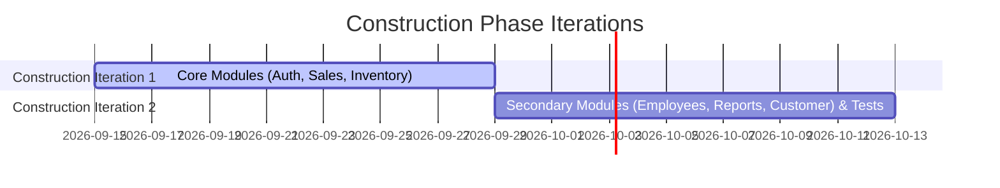

# Construction Phase Report – POS Retail Clothing Store

**UP Phase:** Construction Phase  
**Document Status:** Final Approved  
**Milestone Reached:** Initial Operational Capability (IOC)

---

## 1. Construction Phase Summary & Objectives

The **Construction Phase** focuses on building the production-grade software application, implementing all core and secondary use cases, establishing database schema and seed data, integrating frontend and backend components, and ensuring quality through automated unit testing.

### Key Deliverables Completed
- [x] **Full Stack Implementation:** Developed Node.js/Express backend services and React (Vite) frontend interfaces for all user roles (**Cashier**, **Store Manager**, **Super Admin**).
- [x] **Database & Schema Baseline:** Designed normalized SQLite database schema (`pos.sqlite3`) with tables for employees, product specs, product variants, sales, sales line items, payments, customers, and stock adjustments.
- [x] **Core Features Built (UC1 - UC8):**
  - Authentication & Role-Based Access Control (`/api/auth`)
  - POS Terminal Sales Checkout & Item Scanning (`/api/sales`)
  - Inventory Catalog & Restock Management (`/api/inventory`)
  - Super Admin Employee Management & Role Assignment (`/api/employees`)
  - Executive Sales Reporting & Analytics (`/api/reports`)
- [x] **Automated Test Suite:** Built and executed a 100% passing Jest test suite covering core domain services (28 unit tests across 4 test suites).

---

## 2. Iteration Construction Plan

### Construction Iteration 1
- **Focus:** High-value, core revenue use cases.
- **Implemented:**
  - `authService` & `auth.js` middleware (UC1: Login)
  - `saleService`, `saleRepository`, and POS Terminal UI (UC2: Process Sale)
  - `inventoryService`, `productRepository`, and Restock UI (UC3: Manage Inventory - Restock)
  - SQLite database schema initialization (`schema.sql`) and demo seed data script (`seed.js`).

### Construction Iteration 2
- **Focus:** Administrative control, analytics, and quality assurance.
- **Implemented:**
  - `employeeService`, `employeeRepository`, and Super Admin UI (UC4: Manage Employees)
  - Product variant addition and catalog editing features (UC5: Manage Products)
  - Customer attachment during checkout (UC6: Register Customer)
  - `salesReportService` and Manager Analytics Dashboard (UC8: Generate Sales Reports)
  - Unit test suite construction covering `authService`, `employeeService`, `inventoryService`, and `saleService`.

---

## 3. Implementation Metrics & Quality Assurance

| Metric Category | Value | Description |
|---|---|---|
| **Backend Code Modules** | 18 JS files | Services, Repositories, Routes, Middleware, DB Scripts |
| **Frontend UI Views** | 7 React pages | POS Terminal, Inventory, Employees, Reports, Admin, Login, AppShell |
| **Database Tables** | 8 SQLite tables | Relational database schema with foreign key constraints |
| **Jest Test Suites** | 4 passed | `authService`, `employeeService`, `inventoryService`, `saleService` |
| **Total Automated Tests** | 28 / 28 passed (100%) | Complete unit test coverage for core business logic |

---

## 4. Initial Operational Capability (IOC) Sign-off

All criteria for the **IOC Milestone** have been fulfilled:
- [x] All 8 system use cases fully operational in backend and frontend codebases.
- [x] Automated unit test suite execution confirmed with zero failing tests.
- [x] Application ready for final deployment configuration, user acceptance testing, and Transition Phase release.
