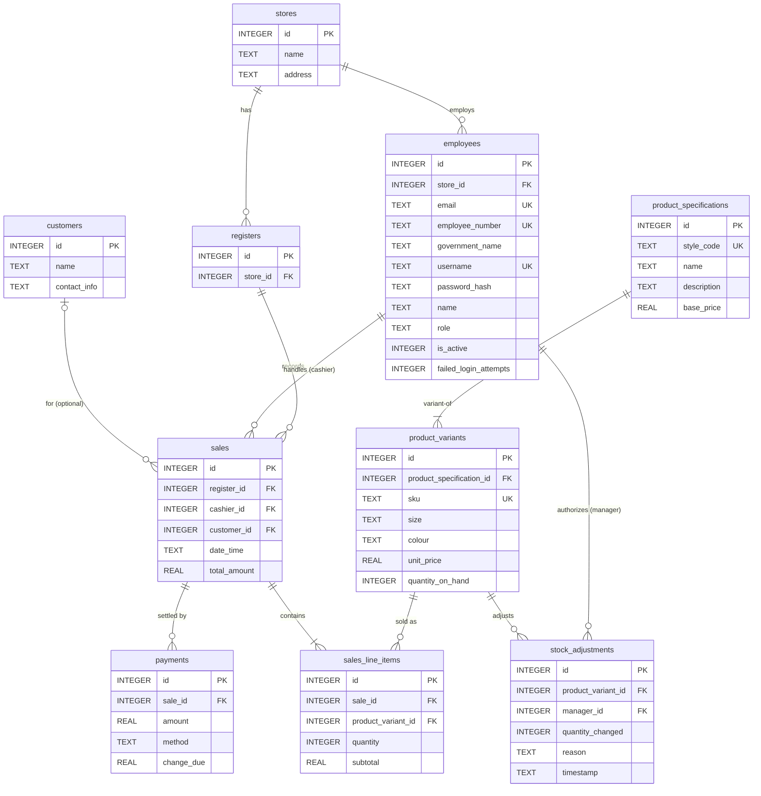

# Database Design – POS Retail Clothing Store

**UP Phase:** Elaboration → Construction (persistence design realized in code)
**Engine:** SQLite (`node:sqlite`), file `backend/data/pos.sqlite3`
**Schema source of truth:** `backend/src/db/schema.sql` (+ startup migrations in `backend/src/db/connection.js`)

This document is the relational counterpart to the [Domain Model & Design Class Diagram](domain_model.md). Conceptual classes there map directly to the tables below; service/repository classes in `backend/src/repositories` are the only components permitted to issue SQL against this schema (see [3-Tier Architecture](architecture.md)).

---

## 1. Entity-Relationship Diagram

---

## 2. Table Definitions

### `stores`
| Column | Type | Constraints | Notes |
|---|---|---|---|
| id | INTEGER | PK, AUTOINCREMENT | |
| name | TEXT | NOT NULL | |
| address | TEXT | | |

### `registers`
| Column | Type | Constraints | Notes |
|---|---|---|---|
| id | INTEGER | PK, AUTOINCREMENT | |
| store_id | INTEGER | NOT NULL, FK → `stores.id` | Each register belongs to exactly one store. |

### `employees`
| Column | Type | Constraints | Notes |
|---|---|---|---|
| id | INTEGER | PK, AUTOINCREMENT | |
| store_id | INTEGER | NOT NULL, FK → `stores.id` | |
| email | TEXT | UNIQUE (index) | Backfilled for legacy rows as `<username>@local.invalid`. |
| employee_number | TEXT | UNIQUE (index) | Backfilled for legacy rows as `LEGACY-<id>`. |
| government_name | TEXT | | Legal name, distinct from display `name`. |
| username | TEXT | NOT NULL, UNIQUE | Login identifier. |
| password_hash | TEXT | NOT NULL | Hashed via `AuthService.hashPassword`; never stores plaintext. |
| name | TEXT | NOT NULL | Display name. |
| role | TEXT | NOT NULL, CHECK IN (`cashier`, `manager`, `superadmin`) | Enforces role enum at the DB layer. |
| is_active | INTEGER | NOT NULL, DEFAULT 1 | Boolean flag; soft-delete uses this instead of row deletion. |
| failed_login_attempts | INTEGER | NOT NULL, DEFAULT 0 | Brute-force lockout counter. |

`email` and `employee_number` are added via startup migration (`migrateEmployeeIdentity` in `connection.js`) rather than the base `CREATE TABLE`, to support databases created before those columns existed.

### `product_specifications`
| Column | Type | Constraints | Notes |
|---|---|---|---|
| id | INTEGER | PK, AUTOINCREMENT | |
| style_code | TEXT | NOT NULL, UNIQUE | Merchandising style code, shared across variants. |
| name | TEXT | NOT NULL | |
| description | TEXT | | Added via `migrateProductDescription`. |
| base_price | REAL | NOT NULL | Default price before variant-level overrides. |

### `product_variants`
| Column | Type | Constraints | Notes |
|---|---|---|---|
| id | INTEGER | PK, AUTOINCREMENT | |
| product_specification_id | INTEGER | NOT NULL, FK → `product_specifications.id` | |
| sku | TEXT | NOT NULL, UNIQUE | Sellable unit identifier (size × colour). |
| size | TEXT | NOT NULL | |
| colour | TEXT | NOT NULL | |
| unit_price | REAL | NOT NULL | Can override `base_price` per variant. |
| quantity_on_hand | INTEGER | NOT NULL, DEFAULT 0 | Live stock count, mutated by sales and `stock_adjustments`. |

### `customers`
| Column | Type | Constraints | Notes |
|---|---|---|---|
| id | INTEGER | PK, AUTOINCREMENT | |
| name | TEXT | NOT NULL | |
| contact_info | TEXT | | Free-form phone/email; sales can proceed without a customer record. |

### `sales`
| Column | Type | Constraints | Notes |
|---|---|---|---|
| id | INTEGER | PK, AUTOINCREMENT | |
| register_id | INTEGER | NOT NULL, FK → `registers.id` | |
| cashier_id | INTEGER | NOT NULL, FK → `employees.id` | |
| customer_id | INTEGER | NULLABLE, FK → `customers.id` | Optional — walk-in sales omit this. |
| date_time | TEXT | NOT NULL | ISO 8601 timestamp. |
| total_amount | REAL | NOT NULL | Sum of line item subtotals. |

### `sales_line_items`
| Column | Type | Constraints | Notes |
|---|---|---|---|
| id | INTEGER | PK, AUTOINCREMENT | |
| sale_id | INTEGER | NOT NULL, FK → `sales.id` | |
| product_variant_id | INTEGER | NOT NULL, FK → `product_variants.id` | |
| quantity | INTEGER | NOT NULL | |
| subtotal | REAL | NOT NULL | `quantity × unit_price` at time of sale (price snapshot, not recomputed from `product_variants`). |

### `payments`
| Column | Type | Constraints | Notes |
|---|---|---|---|
| id | INTEGER | PK, AUTOINCREMENT | |
| sale_id | INTEGER | NOT NULL, FK → `sales.id` | |
| amount | REAL | NOT NULL | Tendered amount. |
| method | TEXT | NOT NULL | e.g. `cash`, `card`. |
| change_due | REAL | NOT NULL, DEFAULT 0 | |

### `stock_adjustments`
| Column | Type | Constraints | Notes |
|---|---|---|---|
| id | INTEGER | PK, AUTOINCREMENT | |
| product_variant_id | INTEGER | NOT NULL, FK → `product_variants.id` | |
| manager_id | INTEGER | NOT NULL, FK → `employees.id` | Employee who authorized the adjustment. |
| quantity_changed | INTEGER | NOT NULL | Signed delta (positive = restock, negative = shrinkage/correction). |
| reason | TEXT | NOT NULL, DEFAULT `'restock'` | |
| timestamp | TEXT | NOT NULL | ISO 8601 timestamp. |

---

## 3. Keys, Indexes & Integrity Rules

- **Foreign keys are enforced at runtime**: `connection.js` sets `PRAGMA foreign_keys = ON`, so orphaned references (e.g. deleting a `product_variant` still referenced by `sales_line_items`) are rejected by SQLite itself, not just application logic.
- **Unique indexes**: `employees.username`, `employees.email`, `employees.employee_number`, `product_specifications.style_code`, `product_variants.sku`.
- **Enum enforcement via CHECK**: `employees.role` is constrained to `cashier` / `manager` / `superadmin` at the schema level, preventing invalid roles from being inserted even by code that bypasses the service layer.
- **Soft delete**: employees are deactivated via `is_active = 0` rather than row deletion, preserving referential integrity for historical `sales` and `stock_adjustments` rows that reference them.
- **Price snapshotting**: `sales_line_items.subtotal` and `payments.amount` capture values at transaction time, so later edits to `product_variants.unit_price` never retroactively change historical sales figures.

---

## 4. Normalization

The schema is in **Third Normal Form (3NF)**:

- **1NF** — every column holds a single atomic value (no repeating groups; a sale's items live in the separate `sales_line_items` table rather than as a delimited list).
- **2NF** — every table uses a single-column surrogate key (`id`), so no partial-key dependencies are possible.
- **3NF** — non-key attributes depend only on their own table's key: e.g. `unit_price`/`quantity_on_hand` live on `product_variants` rather than being duplicated onto `sales_line_items` or `product_specifications`; `base_price` lives once on `product_specifications` rather than being copied across variants.

The one deliberate denormalization is **price snapshotting** (§3): `sales_line_items.subtotal` intentionally does not get recomputed from the current `product_variants.unit_price`, because sales history must reflect the price paid, not the current catalog price.

---

## 5. Design Rationale

- **`product_specifications` vs `product_variants`** — mirrors real apparel retail: a style ("Classic Crew Tee") is one specification with many sellable variants (size × colour), each carrying its own SKU, price override, and stock count.
- **`stores` / `registers`** — modeled for multi-store extensibility even though the current deployment runs a single store, so reporting and access control can later scope by store without a schema change.
- **Optional `customer_id` on `sales`** — most POS transactions are walk-in/anonymous; making the FK nullable avoids forcing a customer record for every sale while still supporting loyalty/CRM lookups when one is provided.
- **Repository-only SQL access** — per the GRASP High Cohesion / Low Coupling mapping in [domain_model.md](domain_model.md#3-grasp-pattern-mapping), only `backend/src/repositories/*.js` issue queries against these tables; services and route handlers never embed SQL directly.

---

## 6. Known Gap

The [Implementation & Testing Specification](implementation_and_testing.md#2-database-er-diagram--relational-schema-design) contains an earlier ER diagram that has drifted from this schema (it omits `stores`/`registers` and uses several renamed columns, e.g. `product_spec_id` instead of `product_specification_id`). This document (`database_design.md`) reflects the current, authoritative schema in `backend/src/db/schema.sql` and `connection.js`; the Construction-phase document should be reconciled to match it.
