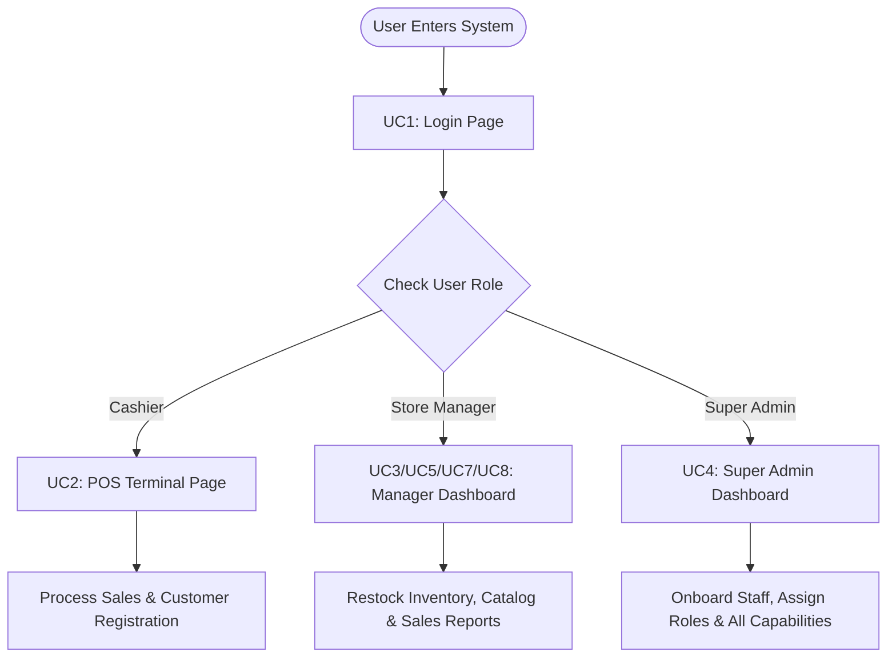

# Deployment & User Operations Manual – POS Retail Clothing Store

**UP Phase:** Transition Phase  
**Document Status:** Final Approved  
**Target Audience:** System Administrators, Store Managers, Cashiers

---

## 1. System Deployment & Environment Guide

### Prerequisites
- **Node.js:** v18.0.0 or higher
- **npm:** v9.0.0 or higher
- **Operating System:** Windows, macOS, or Linux

---

### Step-by-Step Installation & Setup

#### 1. Backend Setup
```bash
# Navigate to the backend directory
cd backend

# Install dependencies
npm install

# Initialize database schema and seed initial store data
npm run seed

# Run backend unit tests to verify system integrity
npm test

# Start the backend server in production/dev mode
npm run dev    # Starts REST API server on http://localhost:4000
```

#### 2. Frontend Setup
```bash
# Open a new terminal and navigate to the frontend directory
cd frontend

# Install dependencies
npm install

# Start the frontend application
npm run dev    # Launches React Vite web app (e.g. http://localhost:5173)
```

---

## 2. User Operations Manual by Role



---

### Role Guide 1: Cashier (Sales Assistant)

#### Initial Login
1. Open the application URL (e.g., `http://localhost:5173`).
2. Enter your cashier username and password provided by the Super Admin.
3. Click **Login**. Upon successful authentication, the **POS Terminal** screen displays.

#### Processing a Sale (UC2)
1. In the **SKU / Item Entry** field, scan or type the item SKU (e.g., `TSH-BLK-M`).
2. Enter the quantity and click **Add Item**.
3. Verify the description, size, color, unit price, and running total.
4. Repeat for all items presented by the customer.
5. (Optional) Enter the customer's phone number or register a new customer profile (UC6).
6. Click **Complete Sale**.
7. Enter the payment method (**Cash** or **Card**) and cash tendered amount.
8. Click **Confirm Payment**. The system calculates change due, updates stock in real time, and prints/renders the receipt summary.

---

### Role Guide 2: Store Manager

#### Restocking Inventory (UC3)
1. Log in with Manager credentials and select **Inventory** from the navigation bar.
2. Click **Restock Item**.
3. Enter the target variant SKU and received quantity.
4. Click **Confirm Restock**. The system updates quantity on hand and logs a timestamped `StockAdjustment` audit record.

#### Product Catalog Management (UC5)
1. Select **Add Product Variant**.
2. Fill in Style Code, Product Name, Base Price, SKU, Size, Color, Unit Price, and Initial Stock.
3. Click **Save Product Variant**.

#### Viewing Stock Levels & Alerts (UC7)
1. Navigate to **Stock Levels**.
2. Items highlighted in amber/red represent inventory below low-stock thresholds (quantity < 5).

#### Generating Sales Reports (UC8)
1. Select **Sales Reports** from the top menu.
2. Select the date range (Daily, Weekly, Monthly, or Custom Range).
3. View aggregated total revenue, total sales count, average transaction value, and top-selling clothing items.

---

### Role Guide 3: Super Admin

#### Onboarding New Employees & Assigning Roles (UC4)
1. Log in with Super Admin credentials and select **Employees** from the navigation menu.
2. Click **Onboard New Employee**.
3. Enter employee full name, unique username, initial password, and select role (`cashier`, `manager`, or `superadmin`).
4. Click **Create Account**.
5. To change an existing employee's role, locate their record in the list, select the new role, and click **Update Role**.
6. To deactivate a departing staff member, click **Deactivate Account** (sets `is_active = 0` to preserve historical audit logs while preventing further logins).

---

## 3. Data Migration, Backup & Disaster Recovery

### Database Seeding & Initial Setup
- Initializing the database is executed via `npm run seed` inside `backend/`.
- Seed scripts populate demo employee accounts (`admin`, `manager`, `cashier`), base clothing specifications (Jeans, Shirts, Jackets), and multi-variant SKUs with stock levels.

### Database Backup Procedure
1. Create a periodic snapshot copy of `backend/data/pos.sqlite3`.
2. To restore in the event of hardware failure, copy the backed-up `pos.sqlite3` file back into `backend/data/` and restart the backend server.
