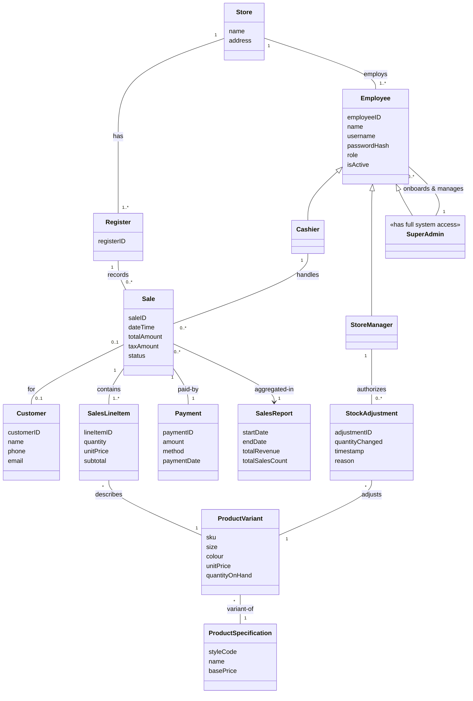

# Domain Model & Design Class Diagram – POS Retail Clothing Store

**UP Phase:** Elaboration Phase  
**Methodology:** Unified Process (Larman, *Applying UML and Patterns*)

Per the Unified Process, the **Domain Model** visualizes conceptual classes in the problem domain, while the **Design Class Diagram (DCD)** bridges domain concepts to software design contracts (methods, parameters, visibility, and navigability).

---

## 1. Conceptual Domain Model

---

## 2. Software Design Class Diagram (DCD)

The DCD illustrates the software components, method signatures, visibility (`+` public, `-` private), and repository dependencies derived from GRASP pattern assignments:

```mermaid
classDiagram
    class AuthService {
        +login(username, password) SessionToken
        +validateToken(token) UserSession
        +hashPassword(plainText) String
    }

    class SaleService {
        +createSale(cashierId, customerId) Sale
        +addSaleItem(saleId, sku, quantity) LineItemResult
        +completeSale(saleId, paymentAmount, paymentMethod) SaleResult
        +getSaleById(saleId) Sale
    }

    class InventoryService {
        +getProductBySku(sku) ProductVariant
        +restockItem(sku, quantity, managerId) StockResult
        +createProductVariant(variantData) ProductVariant
        +listInventory(filters) List~ProductVariant~
    }

    class EmployeeService {
        +onboardEmployee(employeeData) Employee
        +updateEmployeeRole(employeeId, newRole) Employee
        +deactivateEmployee(employeeId) Boolean
        +getAllEmployees() List~Employee~
    }

    class SalesReportService {
        +generateReport(startDate, endDate) ReportSummary
    }

    class SaleRepository {
        +saveSale(saleData) Int
        +saveLineItem(saleId, lineItem) Boolean
        +savePayment(paymentData) Boolean
        +getSalesReport(startDate, endDate) Object
    }

    class ProductRepository {
        +findBySku(sku) ProductVariant
        +updateStock(sku, quantityDelta) Boolean
        +createVariant(variantData) Boolean
        +findAll(options) List
    }

    class EmployeeRepository {
        +findByUsername(username) Employee
        +findById(id) Employee
        +create(employeeData) Employee
        +updateRole(id, role) Boolean
        +softDelete(id) Boolean
    }

    AuthService --> EmployeeRepository
    EmployeeService --> EmployeeRepository
    SaleService --> SaleRepository
    SaleService --> ProductRepository
    InventoryService --> ProductRepository
    SalesReportService --> SaleRepository
```

---

## 3. GRASP Pattern Mapping

- **Controller:** `SaleService`, `InventoryService`, `AuthService`, and `EmployeeService` act as application controllers receiving system operations from Express route handlers.
- **Creator:** `SaleService` creates `Sale` and `SalesLineItem` instances; `InventoryService` creates `StockAdjustment` records.
- **High Cohesion:** Database interactions are strictly encapsulated in Repository classes (`SaleRepository`, `ProductRepository`, `EmployeeRepository`).
- **Low Coupling:** Service classes interact with repositories via plain domain objects, isolating persistence details from UI presentation handlers.
