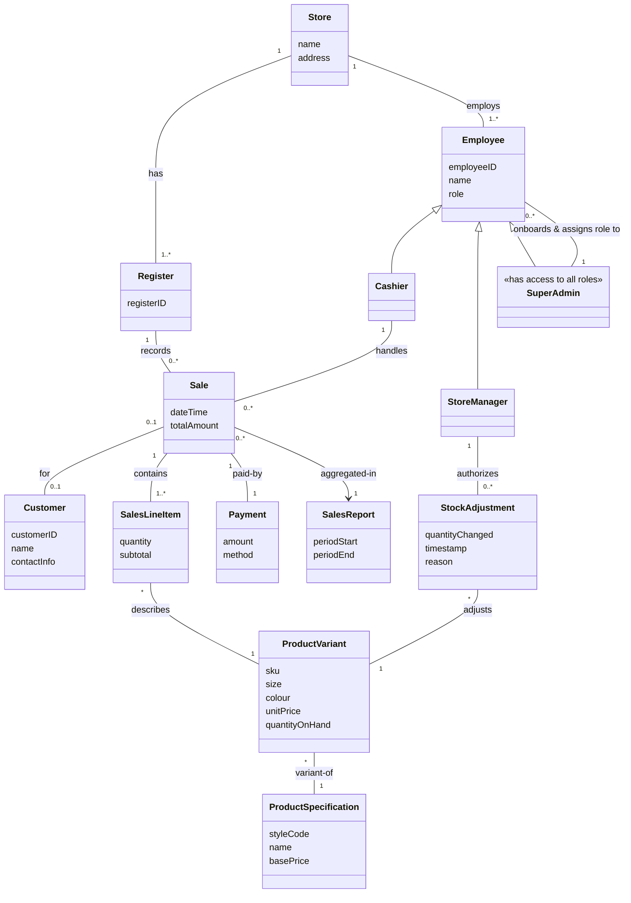

# Domain Model – POS Retail Clothing Store

**UP Phase:** Elaboration – Iteration 1

Per Larman, the Domain Model is a visualization of **conceptual classes** in the problem domain — it contains no operations/methods and is not a software design. Classes below were identified by noun-phrase analysis of the [Problem Statement](problem_statement.md) and the [Detailed Use Cases](detailed_use_cases.md).

## Conceptual Class Diagram

## Notes on Key Conceptual Classes

- **ProductSpecification vs. ProductVariant** — Larman's original POS model has a single `ProductSpecification`. A clothing store needs the extra `ProductVariant` layer because stock, price, and SKU are tracked per *size + colour* combination of a style, not per style alone.
- **Sale / SalesLineItem / Payment** — kept identical in spirit to Larman's canonical POS domain model; this is the same transaction pattern (Sale is a whole, SalesLineItems are its parts, Payment closes it).
- **StockAdjustment** — new concept (not in Larman's original) needed to support the Restock and future Returns use cases, and to provide an audit trail for inventory changes.
- **Employee generalization** — `Cashier`, `StoreManager`, `SuperAdmin` share identity/role attributes but have different permissions, motivating a role hierarchy rather than a single flat `User` class.
- **SuperAdmin** — a single, most-privileged role with access to every capability of every other role (Cashier and StoreManager included), and the *sole* actor responsible for onboarding new employees and assigning their role. This centralizes account provisioning, which is a deliberate trade-off: simpler access control at the cost of a single point of failure (see the updated Risk List in [Risk and Feasibility](risk_and_feasibility.md)).

This model will be refined into a **Design Class Diagram** (with methods, visibility, and navigability) in Elaboration Iteration 2, once responsibilities are assigned via GRASP patterns against the SSDs above.
