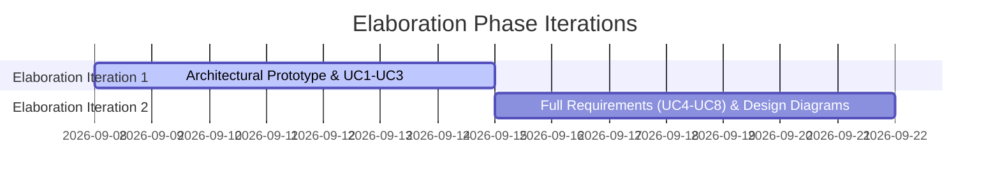

# Elaboration Phase Report – POS Retail Clothing Store

**UP Phase:** Elaboration Phase  
**Document Status:** Final Approved  
**Milestone Reached:** Lifecycle Architecture Baseline (LCA)

---

## 1. Elaboration Phase Objectives & Achievements

The primary objective of the **Elaboration Phase** in the Unified Process (UP) is to stabilize the system architecture, fully detail high-risk use cases, construct an executable architectural prototype, and eliminate major project risks prior to high-volume Construction.

### Summary of Achievements
- [x] **Architectural Baseline Baseline:** Designed and validated a 3-tier layered architecture (Presentation, Application/Domain, Data Access) isolating SQLite persistence from business rules.
- [x] **100% Core Requirements Specified:** Expanded all 8 system use cases (UC1 to UC8) into fully dressed format (per Larman's *Applying UML and Patterns*).
- [x] **Domain & Design Modeling:** Established domain model conceptual classes and mapped them to software Design Class Diagrams (DCDs) utilizing GRASP design patterns (Controller, Creator, High Cohesion, Low Coupling).
- [x] **Architectural Proof-of-Concept:** Built an executable vertical spike verifying end-to-end flow from React UI -> Express API -> SQLite Database.

---

## 2. Iteration Execution Breakdown

### Iteration 1 Goals & Deliverables
- Address highest architectural risk: coupling presentation logic directly to persistence.
- Define fully dressed specifications for architecturally significant use cases: **UC1 (Login)**, **UC2 (Process Sale)**, and **UC3 (Restock Inventory)**.
- Construct the 3-tier architectural baseline and domain model.

### Iteration 2 Goals & Deliverables
- Detail remaining system use cases: **UC4 (Manage Employees)**, **UC5 (Manage Products)**, **UC6 (Register Customer)**, **UC7 (View Stock Levels)**, and **UC8 (Generate Sales Reports)**.
- Refine domain conceptual model into software Design Class Diagrams with method signatures, parameters, visibility, and associations.
- Verify System Sequence Diagrams (SSDs) for all 8 use cases.

---

## 3. Key Architectural Baseline Decisions

1. **3-Tier Layering:** Strict unidirectional dependencies: Presentation -> Domain/Application -> Data Access -> Database.
2. **Repository Pattern:** Encapsulate raw SQL execution within repository modules (`SaleRepository`, `ProductRepository`, `EmployeeRepository`), allowing underlying database engine substitution without affecting domain logic.
3. **Role-Based Access Control (RBAC):** Centralized authorization in `AuthService` and Express middleware enforcing access checks across Cashier, Store Manager, and Super Admin roles.
4. **Data Model Differentiation:** Separation of `ProductSpecification` (style code, name, base price) from `ProductVariant` (SKU, size, color, unit price, stock) to handle retail clothing store inventory requirements.

---

## 4. Lifecycle Architecture Baseline (LCA) Sign-off

The Elaboration Phase successfully concluded with all **LCA Milestone criteria** fulfilled:
- [x] Core 3-tier architecture stabilized and tested via architectural spike.
- [x] Major technical, architectural, and security risks mitigated.
- [x] Comprehensive requirements baseline finalized for Construction Phase implementation.
