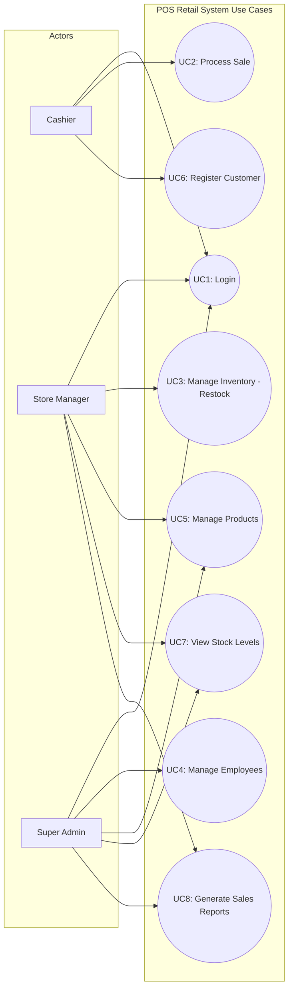

# High-Level Requirements – POS Retail Clothing Store

**UP Phase:** Inception & Elaboration  
**Format:** FURPS+ Model (Functionality, Usability, Reliability, Performance, Supportability)

---

## 1. Primary System Actors

| Actor | Description | Key Responsibilities |
|---|---|---|
| **Cashier (Sales Assistant)** | Front-line store employee operating the POS checkout terminal | Processes customer sales, enters items, accepts payments, issues receipts, registers customer details. |
| **Store Manager** | Supervisory staff managing store inventory and operational metrics | Restocks inventory, manages product catalog (styles/sizes/colors), views stock levels, generates sales reports. |
| **Super Admin** | System administrator with full system privileges | Onboards new employees, assigns role credentials, manages accounts, and holds override capabilities across all screens. |
| **Customer** | End buyer interacting with the cashier during sales transactions | Presents items for purchase, provides optional customer registration details, makes payment, receives receipt. |

---

## 2. Complete Use Case Catalog (UC1 – UC8)

---

## 3. FURPS+ Non-Functional Requirements

### Functionality (F)
- **Role-Based Access Control (RBAC):** Authenticate users and restrict features based on role (`cashier`, `manager`, `superadmin`).
- **Data Integrity:** Real-time atomic inventory deduction upon sale confirmation; rollback on failure.
- **Auditability:** Log all restock adjustments, employee creation events, and sales transactions.

### Usability (U)
- **POS Checkout Efficiency:** Intuitive cashier terminal layout requiring minimal keystrokes to add item, enter quantity, and finalize payment.
- **Visual Feedback:** Instant alert banners for low stock, invalid SKU, or unauthorized access attempts.

### Reliability (R)
- **Fault Tolerance:** Robust database constraints preventing negative inventory balances or duplicate SKUs.
- **Session Security:** Automatic token expiration and lockouts after 5 consecutive failed login attempts.

### Performance (P)
- **Transaction Speed:** Item scanning/SKU lookup subtotal calculation in under 1 second.
- **Database Query Time:** Sales analytics query execution under 500ms for up to 100,000 historical records.

### Supportability (S)
- **Layered Architecture:** 3-tier presentation, domain/application, data access structure allowing independent upgrades.
- **Cross-Platform Compatibility:** Responsive web interface accessible across desktop monitors and tablet registers.
