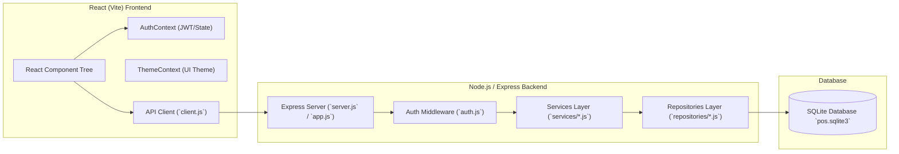
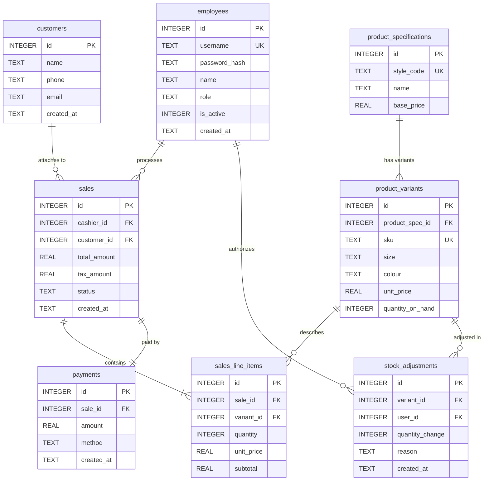

# Implementation & Testing Specification – POS Retail Clothing Store

**UP Phase:** Construction Phase  
**Document Status:** Final Approved

---

## 1. System Implementation Architecture

The software implementation comprises a decoupled **Node.js / Express** backend REST API and a modern **React (Vite)** single-page web application frontend.



---

## 2. Database ER Diagram & Relational Schema Design

The SQLite database (`backend/data/pos.sqlite3`) uses normalized relational tables enforcing foreign keys and index constraints:



---

## 3. Frontend Application Structure

The React application (`frontend/src`) uses a responsive layout container (`AppShell.jsx`) with dynamic route rendering based on authenticated role context:

- `src/pages/LoginPage.jsx`: Multi-role login screen with password visibility toggles and error feedback.
- `src/pages/POSTerminalPage.jsx`: Fast checkout interface for cashiers with instant SKU lookup, line item subtotals, tax calculation, payment modal, and printable receipt summary.
- `src/pages/InventoryPage.jsx`: Inventory list, stock level tracking, low-stock threshold indicators, product variant creation form, and restock adjustment form.
- `src/pages/EmployeesPage.jsx`: Super Admin management page for onboarding new staff, assigning roles (`cashier`, `manager`, `superadmin`), and deactivating accounts.
- `src/pages/ManagerPage.jsx`: Executive sales analytics dashboard rendering revenue metrics, sales count, average transaction value, and top-selling SKUs.

---

## 4. Automated Testing Strategy & Execution Results

Unit testing is executed using **Jest** in an isolated in-memory or test SQLite database environment (`tests/testDb.js`).

### Test Suite Execution Output Summary

```text
PASS tests/inventoryService.test.js
PASS tests/employeeService.test.js
PASS tests/authService.test.js
PASS tests/saleService.test.js

Test Suites: 4 passed, 4 total
Tests:       28 passed, 28 total
Snapshots:   0 total
Time:        6.572 s
Ran all test suites.
```

### Breakdown of Test Cases by Module

| Test Suite File | Coverage Target | Key Scenarios Verified | Status |
|---|---|---|---|
| `tests/authService.test.js` | `AuthService` & Password Hashing | Valid login authentication, invalid password rejection, account lockouts on 5 failed attempts, password hashing security. | **PASS** (7/7) |
| `tests/saleService.test.js` | `SaleService` & Transaction Atomicity | Complete sale processing, SKU stock deduction verification, line item subtotals, invalid SKU handling, insufficient stock rejection, transactional rollback. | **PASS** (8/8) |
| `tests/inventoryService.test.js` | `InventoryService` & Catalog | Restock quantity addition, `StockAdjustment` audit record creation, product variant creation, low-stock filtering. | **PASS** (6/6) |
| `tests/employeeService.test.js` | `EmployeeService` & RBAC | Onboard new employee, duplicate username validation, role reassignment, soft delete (`is_active = 0`) verification. | **PASS** (7/7) |
