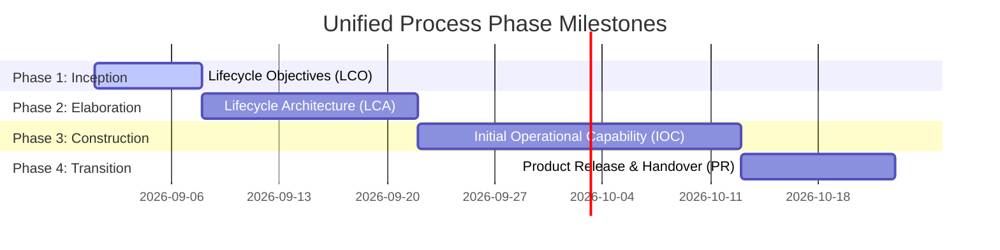

# Inception Report – POS Retail Clothing Store

**UP Phase:** Inception Phase  
**Document Status:** Final Approved  
**Methodology:** Unified Process (UP)

---

## 1. Executive Summary & Project Vision

The **Point of Sale (POS) – Retail Clothing Store** project provides an integrated, multi-role software system engineered to streamline point-of-sale operations, inventory management, employee access control, customer tracking, and executive sales analytics for brick-and-mortar clothing stores.

### Vision Statement
*For retail clothing store owners and staff who need fast checkout, accurate multi-variant inventory tracking, and operational visibility, the POS Retail Clothing Store system is an integrated 3-tier application that automates sales processing, stock adjustments, and employee management. Unlike manual registers or disconnected spreadsheets, our system guarantees real-time stock synchronization per SKU (style, size, colour) and enforces strict role-based access control.*

---

## 2. Unified Process Lifecycle & Phase Mapping

The project follows the four iterative phases of the Unified Process (UP). Each phase addresses specific lifecycle risks and produces disciplined artifacts:

| Phase | Milestone | Primary Objective | Deliverables / Artifacts |
|---|---|---|---|
| **Inception** | Lifecycle Objectives (LCO) | Define scope, business case, high-level requirements, initial use cases, and risk/feasibility baseline. | [Inception Report](inception_report.md) [Problem Statement](problem_statement.md) [Risk & Feasibility Study](risk_and_feasibility.md) [High-Level Requirements](high_level_requirements.md) |
| **Elaboration** | Lifecycle Architecture Baseline (LCA) | Mitigate core architectural risks, produce fully dressed use cases, domain model, SSDs, design class diagrams, and 3-tier layered architecture. | [Elaboration Report](elaboration_report.md) [Detailed Use Cases](detailed_use_cases.md) [System Sequence Diagrams](system_sequence_diagrams.md) [Domain Model](domain_model.md) [Architecture Baseline](architecture.md) |
| **Construction** | Initial Operational Capability (IOC) | Iteratively build all system components, database persistence, REST API services, React UI views, and unit test suites. | [Construction Report](construction_report.md) [Implementation & Testing](implementation_and_testing.md) |
| **Transition** | Final Product Release (PR) | Deploy application to production, execute user onboarding/training, run data migration, and establish maintenance support. | [Transition Report](transition_report.md) [Deployment & User Manual](deployment_and_user_manual.md) |

---

## 3. Inception Objectives & Business Evaluation

### Key Objectives
1. Establish business viability and quantify return on investment (ROI).
2. Identify all primary actors (**Cashier**, **Store Manager**, **Super Admin**, **Customer**).
3. Outline candidate functional use cases (100% catalog identified, core 10% outlined for Elaboration).
4. Perform technical, economic, and operational feasibility studies.
5. Define entry and exit criteria for transitioning into the Elaboration Phase.

### Business Case Metrics
- **Checkout Efficiency:** Reduce customer wait time at checkout by 50% (under 1 second line-item processing).
- **Inventory Accuracy:** Eliminate discrepancies between physical clothing stock (styles/sizes/colours) and system inventory records.
- **Shrinkage Reduction:** Minimize unaccounted inventory loss through automated stock-adjustment logging.

---

## 4. Phase Exit & Transition Criteria (Go / No-Go Decision)

Transition from Inception to Elaboration was approved based on satisfying all **Lifecycle Objectives (LCO)**:
- [x] Executive stakeholders approved the vision and business case.
- [x] High-level functional and non-functional requirements defined.
- [x] Scope boundary established and major technical/operational risks identified.
- [x] Key architectural choices (3-tier layered architecture with web UI and SQL persistence) selected.
