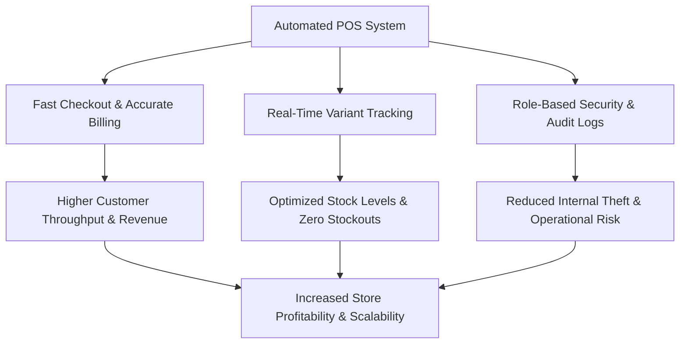

# Problem Statement & Business Case – POS Retail Clothing Store

**UP Phase:** Inception Phase  
**Document Status:** Final Approved

---

## 1. Problem Statement

Retail clothing store operations face unique operational challenges due to item variant complexity (styles, sizes, colors, SKUs) and fast-paced checkout environments. Legacy manual processes or generic off-the-shelf spreadsheets result in critical operational failures:

### Operational Deficiencies
- **Stock Inaccuracies & Overselling:** Inability to track real-time stock levels for specific variant combinations (e.g., Slim-fit Denim Jeans in Medium / Blue vs Large / Black).
- **Slow Checkout Bottlenecks:** Manual price lookups and hand-calculated subtotals lead to long queues, cashier calculation errors, and customer dissatisfaction.
- **Uncontrolled Access & Lack of Auditability:** Shared login credentials allow unauthorized price edits or unmonitored stock adjustments without role-based accountability.
- **Poor Decision Support & Analytics:** Lack of daily, weekly, and monthly sales trends makes purchasing decisions reactive rather than data-driven.

---

## 2. Comprehensive Business Case

The **POS Retail Clothing Store System** addresses these issues through centralized automation, real-time inventory synchronization, and role-based access control.

### Strategic Business Objectives

| Business Objective | Key Performance Indicator (KPI) | Target Result |
|---|---|---|
| **Operational Efficiency** | Average transaction processing time | < 1 second line-item add time; < 30 seconds total checkout |
| **Inventory Accuracy** | Inventory variance percentage | Near zero variance across all product variants (SKUs) |
| **Shrinkage Control** | Unaccounted stock loss | Logged audit trail for 100% of restock and adjustment events |
| **Role-Based Security** | Access violations / unauthorized actions | Zero unauthorized access to manager/admin functions |

### Financial & Operational Value Proposition

- **Increased Profitability:** Faster transaction processing increases checkout throughput during peak hours.
- **Capital Optimization:** Accurate stock reporting prevents over-purchasing slow-moving inventory and eliminates out-of-stock scenarios for popular sizes.
- **Cost Reduction:** Minimizes human calculation errors at register and cuts staff time spent on manual physical inventory audits.

---

## 3. Scope Boundaries & Constraints

### In-Scope
- User authentication and role-based access control (**Cashier**, **Store Manager**, **Super Admin**).
- Sales processing (SKU lookup, line item subtotals, tax calculation, change calculation, receipt generation).
- Inventory restock and catalog management (styles, SKUs, sizes, colors, pricing, quantity on hand).
- Onboarding employees and managing role privileges (Super Admin exclusive).
- Sales performance reporting (total revenue, sales count, top-performing items).

### Out-of-Scope (Future Enhancements)
- Multi-store cross-warehouse logistics routing.
- Integrated credit card payment terminal hardware integrations (simulated via payment status).
- E-commerce customer web portal synchronization.
