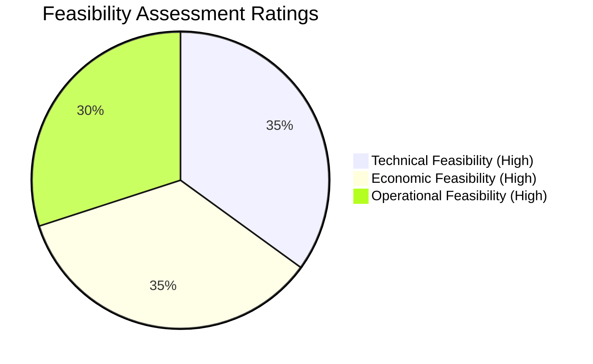

# Risk List & Feasibility Study – POS Retail Clothing Store

**UP Phase:** Inception through Transition (Lifecycle Document)  
**Document Status:** Updated & Active

---

## 1. Unified Process Risk Management Strategy

Per the Unified Process (UP) risk-driven principle, project risks are identified early in Inception, systematically addressed and mitigated in Elaboration, monitored during Construction, and verified in Transition.

---

## 2. Master Risk Matrix Across UP Phases

| Risk ID | Risk Category | Risk Description | Severity | UP Phase Addressed | Mitigation Strategy | Lifecycle Status |
|---|---|---|---|---|---|---|
| **R-01** | Technical / Architecture | Poor database separation leading to performance bottlenecks and tight coupling | High | Elaboration | Implement 3-tier layered architecture with explicit repository pattern isolating SQL persistence from business logic | **Mitigated** |
| **R-02** | Security | Unauthorized access or privilege escalation across cashier/manager roles | High | Elaboration / Construction | Enforce strict role-based access control (RBAC) via `AuthService` and middleware; Super Admin role centralization | **Mitigated** |
| **R-03** | Technical / Data | Data loss during concurrent sales transactions or system crash | High | Construction | Transactional SQLite commits, constraint validation, and automated rollback handling | **Mitigated** |
| **R-04** | Operational | Staff resistance or difficulty navigating POS terminal during live sales | Medium | Transition | Role-tailored user interfaces (Cashier, Manager, Admin) and minimal-click workflow design | **Mitigated** |
| **R-05** | Schedule / Scope | Timeline slippage due to expanding feature scope beyond core POS capability | Medium | Inception / Elaboration | Iterative development scheduling core use cases (UC1-UC3) in early iterations and deferring secondary features | **Mitigated** |
| **R-06** | Single Point of Failure | Super Admin account compromise or unavailability | High | Elaboration / Construction | Password hashing (bcrypt), account lockouts on failed logins, and documented admin account recovery protocol | **Mitigated** |
| **R-07** | Data Migration | Stock quantity discrepancies when migrating legacy inventory records | Medium | Transition | Migration validation scripts with pre/post checksum verification and dry-run execution | **Mitigated** |

---

## 3. Comprehensive Feasibility Analysis

### Technical Feasibility — **HIGH**
- **Architecture & Stack:** Built on proven, standard industry technologies: Node.js/Express, SQLite (`node:sqlite`), React, and Vite.
- **Hardware Compatibility:** Lightweight architecture requires low system memory and standard barcode/receipt printing hardware.
- **Maintainability:** Modular repository pattern ensures database engine can be swapped or scaled cleanly.

### Economic Feasibility — **HIGH**
- **Cost Structure:** Built entirely using open-source, zero-licensing tech stack (Node.js, React, SQLite).
- **Return on Investment (ROI):** Payback achieved rapidly through eliminated cash register discrepancies, reduced inventory loss, and reduced staff checkout time.
- **Operational Savings:** Eliminates ongoing manual accounting reconciliation costs.

### Operational Feasibility — **HIGH**
- **Usability:** Cashiers require minimal training due to an intuitive POS terminal layout with real-time feedback.
- **Role Alignment:** Distinct screens for Cashier (Process Sale), Manager (Inventory/Reports), and Super Admin (Employee Onboarding) match daily store operational roles seamlessly.
