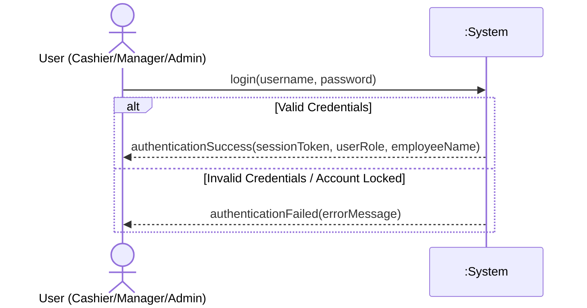
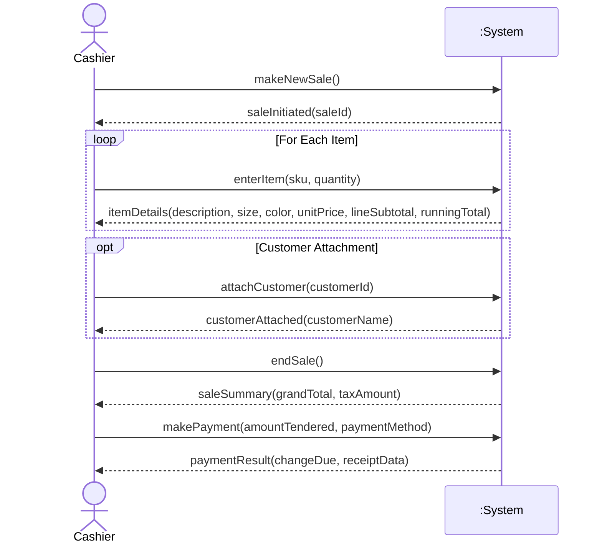
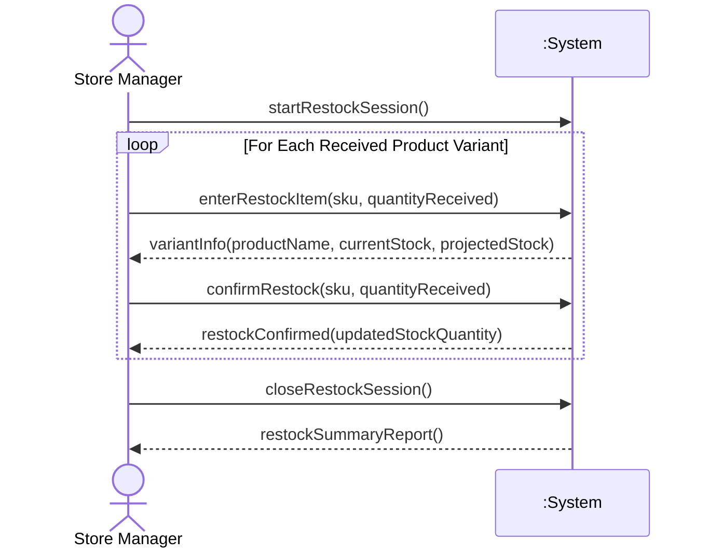
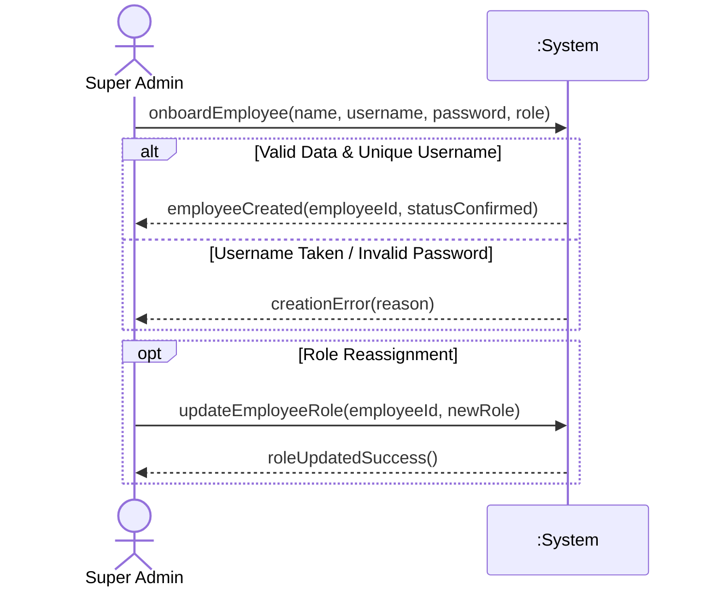
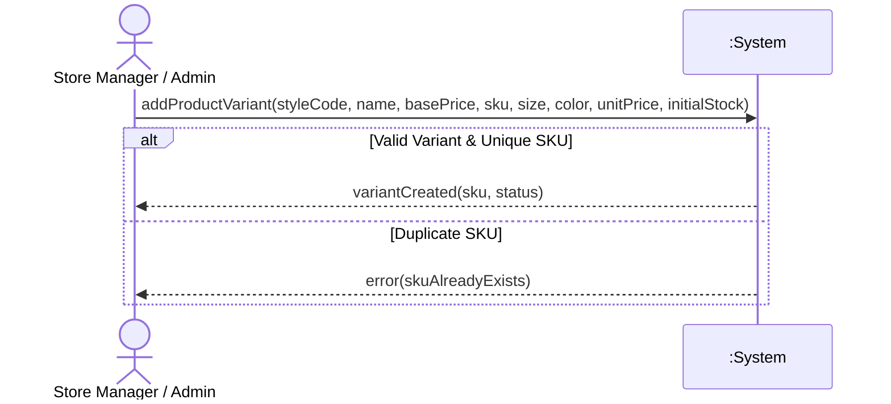
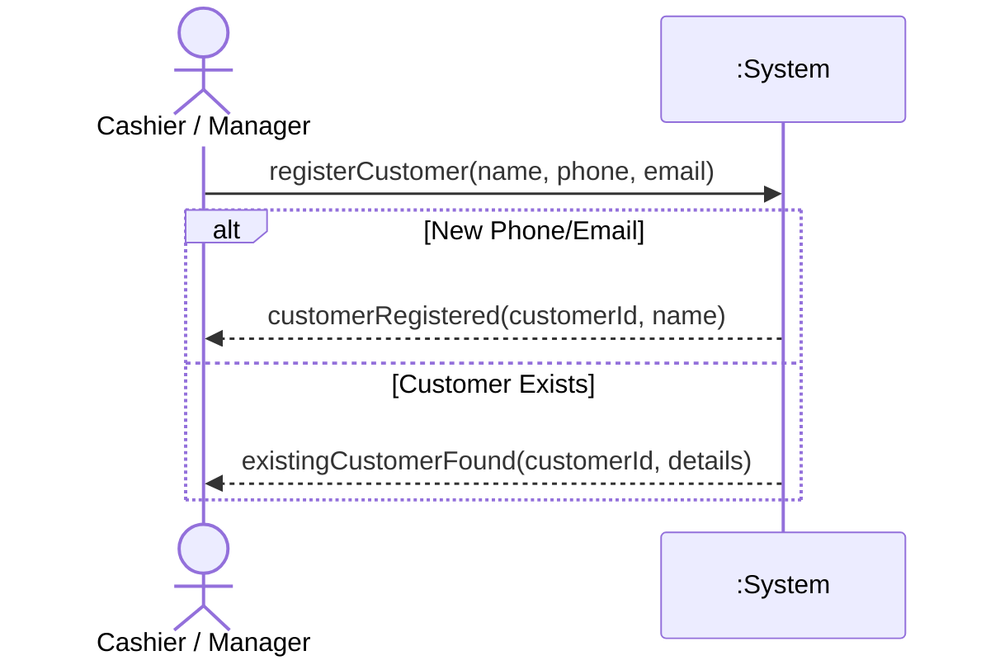
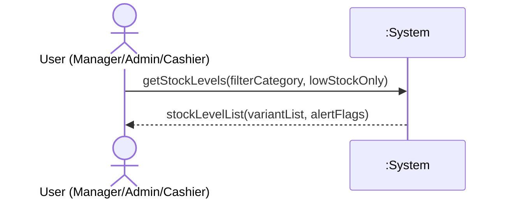
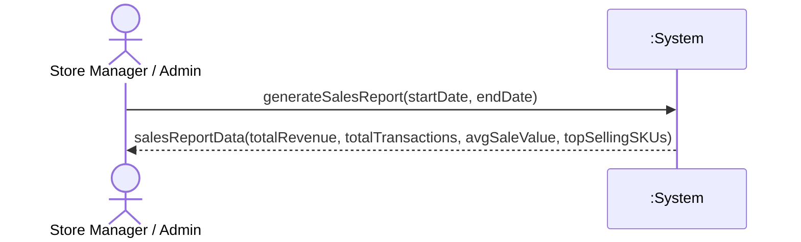

# System Sequence Diagrams (SSDs) – POS Retail Clothing Store

**UP Phase:** Elaboration Phase  
**Methodology:** Unified Process (Larman, *Applying UML and Patterns*)

A System Sequence Diagram (SSD) treats the entire system as a single black-box object (`:System`) and illustrates the input system events generated by actors and the system's corresponding return messages.

---

## SSD1: Login (UC1)

---

## SSD2: Process Sale (UC2)

---

## SSD3: Manage Inventory – Restock Item (UC3)

---

## SSD4: Manage Employees – Onboard & Assign Role (UC4)

---

## SSD5: Manage Products (UC5)

---

## SSD6: Register Customer (UC6)

---

## SSD7: View Stock Levels (UC7)

---

## SSD8: Generate Sales Reports (UC8)

