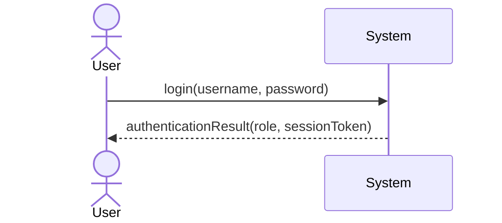
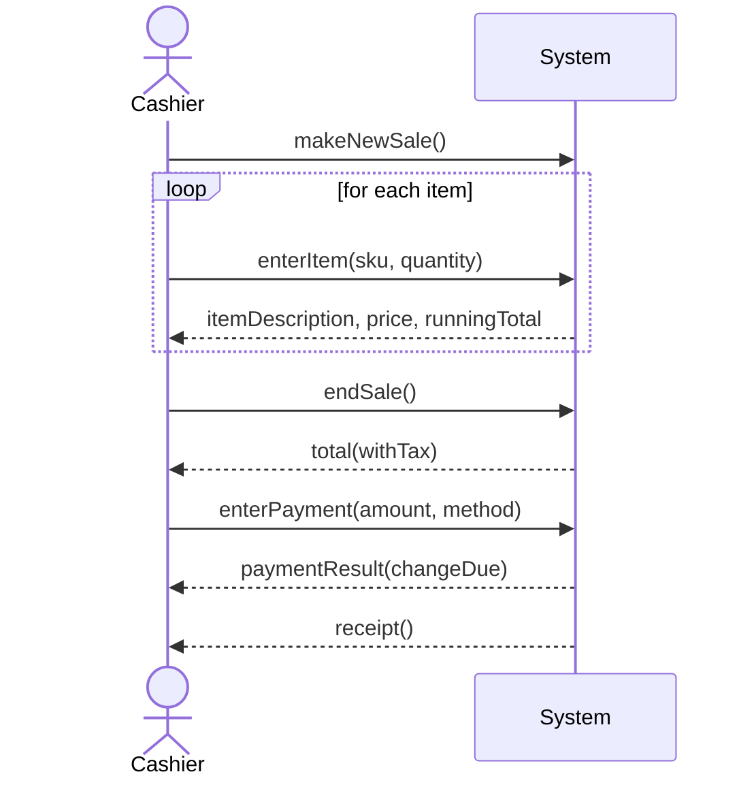
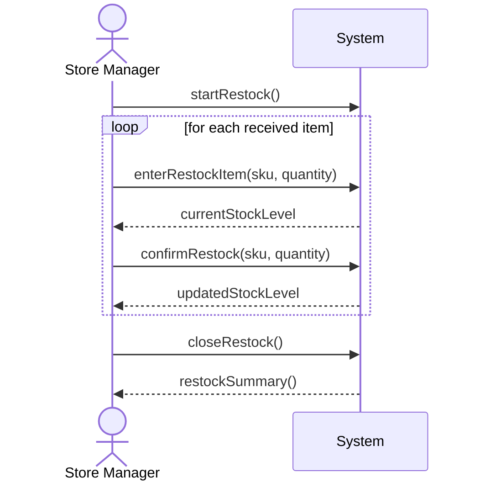

# System Sequence Diagrams (SSDs) – POS Retail Clothing Store

**UP Phase:** Elaboration – Iteration 1

Per Larman, a System Sequence Diagram treats the whole system as a single black-box object and shows the actor's calls to it and the system's return values for the main success scenario of each use case in [Detailed Use Cases](detailed_use_cases.md). No internal objects appear here — that comes later in the Design Class Diagrams.

---

## SSD1: Login

---

## SSD2: Process Sale

---

## SSD3: Manage Inventory – Restock Item

---

These three SSDs correspond one-to-one with the fully dressed use cases (UC1–UC3) documented for this iteration. SSDs for the remaining use cases will be produced in Elaboration Iteration 2 alongside their detailed use case descriptions.
