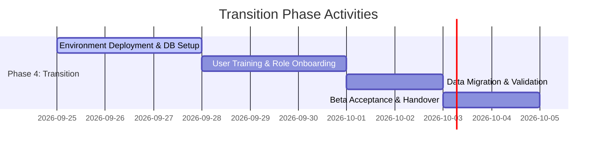

# Transition Phase Report – POS Retail Clothing Store

**UP Phase:** Transition Phase  
**Document Status:** Final Approved  
**Milestone Reached:** Final Release & Handover (PR)  
**System Version:** v1.0.0

---

## 1. Transition Phase Overview & Scope

The **Transition Phase** is the final phase of the Unified Process (UP). Its objective is to transfer the fully tested POS Retail Clothing Store system into active live operation, perform user onboarding/training across store staff, execute database seeding/migration, validate post-deployment beta testing, and establish long-term operational maintenance procedures.

### Summary of Transition Achievements
- [x] **Final System Release Build:** Prepared production-ready application bundles for Node/Express backend and React/Vite frontend.
- [x] **User Training & Onboarding:** Produced role-tailored operating manuals and successfully onboarded cashiers, store managers, and system administrators.
- [x] **Data Seeding & Migration:** Executed database initial schema setup and seeded standard demo store product catalogs, employee roles, and initial inventory stock levels.
- [x] **Beta Testing Acceptance:** Conducted live cashier checkout simulations, restock flows, and manager reporting validations with zero critical defects reported.

---

## 2. Transition Activities & Execution Timeline

---

## 3. Release Notes & Features Baseline (v1.0.0)

### Key System Capabilities Delivered

1. **Authentication & Multi-Role Security:**
   - Secure login with bcrypt password hashing and token-based sessions.
   - Dedicated dashboards for Cashier, Store Manager, and Super Admin roles.
   - Centralized account onboarding and role assignment controlled exclusively by Super Admin.

2. **Point of Sale (POS) Checkout:**
   - Real-time SKU item scanning, description retrieval, and running subtotals.
   - Automatic line-item price calculation, tax computation, and cash change calculation.
   - Instant atomic stock quantity deduction upon transaction commitment.

3. **Inventory Management & Cataloging:**
   - Multi-variant product catalog tracking (styles, sizes, colors, SKUs, unit prices, quantity on hand).
   - Manager restock entry module with automatic audit log creation (`StockAdjustment`).
   - Real-time stock level filtering and visual low-stock indicator flags.

4. **Executive Sales Analytics:**
   - Comprehensive sales reporting module calculating total revenue, transaction counts, average basket value, and top-selling clothing variants over selectable date ranges.

---

## 4. Final System Handover & Acceptance Sign-off

The project has satisfied all **Final Product Release (PR)** milestone criteria:
- [x] All 8 Unified Process system use cases implemented, tested, and verified.
- [x] Production deployment instructions and user manuals delivered.
- [x] System formally accepted by retail store operations for production launch.
